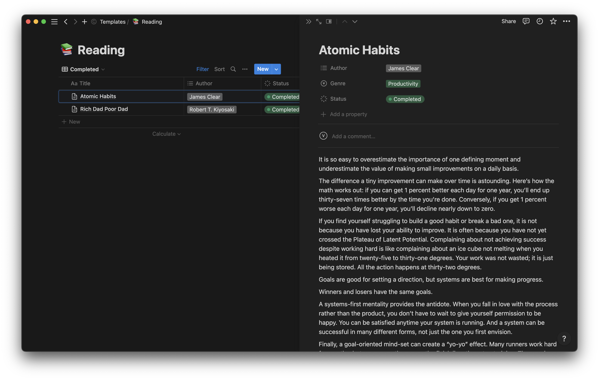

# kindle-to-notion

Export highlights made on a Kindle device to a custom Notion page. This is achieved by parsing the data stored on the `My Clippings.txt` file on the Kindle, and uploading it via the Notion API.

## Example

Below is an example of how the highlights will look once added to the Notion database.



## Usage

### Copy Notion template

1. Copy my Notion reading tracker by clicking 'Duplicate' at the top of the following page: [Reading tracker template](https://vimanyu.notion.site/f9fba4fe37f54ed098dbbfe7c6d15878?v=9ccb4031b1684449a8361b150a561d30).
2. Update the page with your reading list. Make sure the title of each book in the database matches its name on the Kindle.

### Get `My Clippings.txt` file

1. Connect your Kindle via cable to your computer.
2. Navigate to the `documents` folder.
3. Copy the `My Clippings.txt` file.
4. Create a new folder at the top-level of this project called `resources`.
5. Paste the `My Clippings.txt` file in this `resources` folder. Do not edit the name or contents of the file.

### Get Notion credentials

1. Follow the instructions on the following page to create an internal Notion integration and retrieve the integration token: [Create integrations with the Notion API](https://www.notion.so/help/create-integrations-with-the-notion-api#create-an-internal-integration).
2. Refer to the 'Where can I find my database's ID?' section on the following page to get your database ID: [Working with databases](https://developers.notion.com/docs/working-with-databases#adding-pages-to-a-database).

### Add Notion credentials

1. Create a file called `.lein-env` at the root directory of this project.
2. Upload your credentials to this file in the following format.

```clojure
{ :notion-key   "secret_LrKpVbyAsuE0X9Jm3Wn6GqHxTgFwDfj7Nc8eizoIOP1"
  :notion-db-id "938e761bc8a548019b1fc26de59e1e9d" }
```

Note that the identifiers above are not my actual credentials. These are purely placeholders to illustrate the syntax of the environment variables.

### Execute script

While in the root directory of the project, execute the following command to run the `-main` function in `core.clj`.

```zsh
lein run
```

## Room for improvement

### Highlights longer than 2000 characters

- Notion allows a maximum of 2000 characters in a text block.
- Currently, if a highlight is longer than 2000 characters, the code ignores it.
- To avoid losing these highlights, we should split them into multiple blocks.

### Overlapping clippings

- The `My Clippings.txt` file on Kindle devices does not delete data from the file when a highlight is removed from text.
- When a new annotation is added, the device appends it to the existing file without deleting any previous annotations.
- This can result in multiple clippings with overlapping text. For example, we may extract the following highlights for a book:

```clojure
({:title "How to Win Friends and Influence People",
  :author "Dale Carnegie",
  :start-loc 88,
  :end-loc 91,
  :added-at "Thursday, 23 February 2023 21:52:00",
  :text "By criticizing, we do not make lasting changes and often incur resentment. Hans"}
 {:title "How to Win Friends and Influence People",
  :author "Dale Carnegie",
  :start-loc 88,
  :end-loc 90,
  :added-at "Thursday, 23 February 2023 21:52:14",
  :text "By criticizing, we do not make lasting changes and often incur resentment."})
```

- In the example above, I included "Hans" at the end of the first highlight by mistake, and later edited it to remove that part.
- Despite the edit, both the original and edited highlights are present in the `My Clippings.txt` file.
- To avoid this, it would be useful to identify overlapping highlights and keep only the most recent one based on the `:added-at` value.

## License

Copyright © 2023 Vimanyu Taneja

This program and the accompanying materials are made available under the
terms of the Eclipse Public License 2.0 which is available at
http://www.eclipse.org/legal/epl-2.0.

This Source Code may also be made available under the following Secondary
Licenses when the conditions for such availability set forth in the Eclipse
Public License, v. 2.0 are satisfied: GNU General Public License as published by
the Free Software Foundation, either version 2 of the License, or (at your
option) any later version, with the GNU Classpath Exception which is available
at https://www.gnu.org/software/classpath/license.html.
